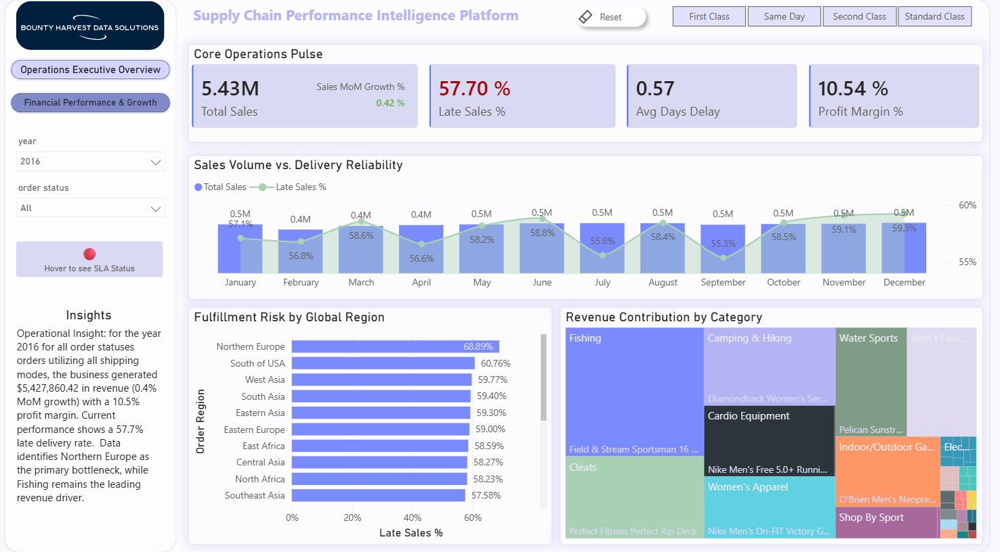
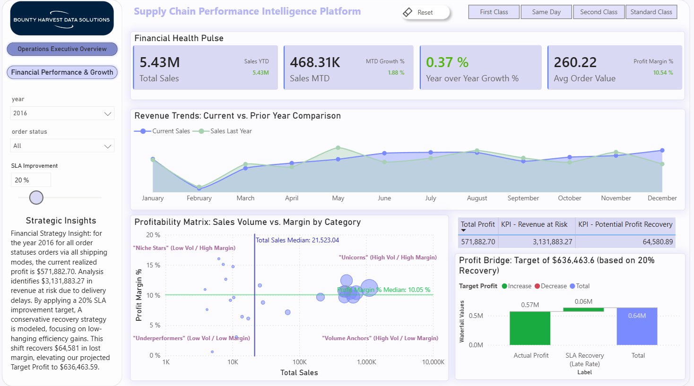
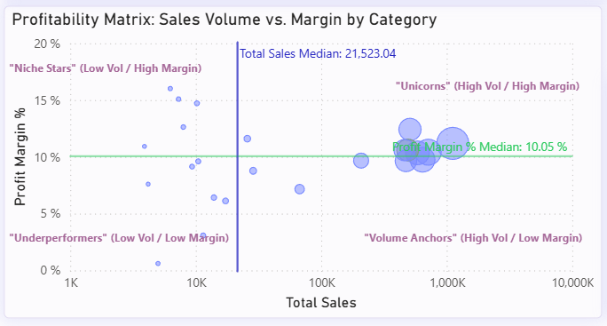
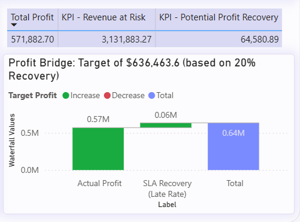
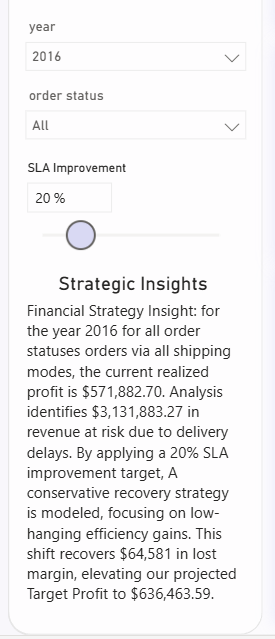

# Nexus: Supply Chain Intelligence Lakehouse: End-to-End Medallion Pipeline (dbt + Databricks + Power BI)

 
> **Executive Summary:** A high-performance Data Engineering pipeline refactoring raw shipment data into a Star Schema, featuring prescriptive financial modeling and automated strategic narratives.

---

## 📊 Project Overview
This repository contains a high-performance Data Engineering pipeline that refactors raw, nested supply chain shipment data into an optimized **Star Schema**. Designed specifically for Power BI "Drill Down" analytics, the project utilizes the **Medallion Architecture** (Bronze, Silver, Gold) to ensure "Zero-Defect" reporting and full data traceability.


## 🏗️ Infrastructure & Data Engineering

### 1. dbt Medallion Pipeline (Lineage)
The pipeline transitions from a flat transactional stream to a convergent Star Schema, ensuring that the Fact table is fully validated against tested Dimensions.


* **Bronze:** Raw landing zone.
* **Silver:** `int_shipments` Transformation hub using MD5 surrogate keys.
* **Gold:** Consumption layer with `fct_shipping_performance` and modular dimensions.
---

## 🏗️ Infrastructure & Setup

### 1. Databricks Warehouse Configuration
The compute layer is hosted on Databricks to leverage Delta Lake's performance:
* **SQL Warehouse:** A "Pro" SQL Warehouse was provisioned to handle compute for `dbt-fusion` workloads.
* **Server Hostname & HTTP Path:** Configured unique cluster paths (e.g., `/sql/1.0/warehouses/...`) in the dbt `profiles.yml` to route queries directly to the compute instance.
* **Authentication:** Secured via a **Personal Access Token (PAT)** generated in Databricks User Settings for service-account authorization.

### 2. dbt Project Initialization
* **Adapter:** Utilized `dbt-databricks` for native compatibility with Spark/Delta Lake.
* **Layer Strategy:**
    * **Bronze:** Raw Landing (`external_source`) - Preserves original state for reprocessing.
    * **Silver (`int_shipments`):** Transformation hub for data sanitization, type casting (Decimal/Timestamp), and MD5 surrogate key generation using `dbt_utils`.
    * **Gold:** Modular Star Schema consumption layer featuring `dim_` tables and the central `fct_` table.

---

## 📈 Business Intelligence & Analysis (The "So What?")
While the engineering layer ensures data integrity, the Power BI layer translates these bits into **Executive Strategy**.

### **1. The Profitability Matrix (Risk vs. Reward Quadrant)**
To go beyond simple averages, I engineered a **Profitability Matrix** that plots categories/regions into four distinct quadrants. This allows executives to see exactly where margin is being eroded by logistics failures.

This quadrant analysis identifies exactly where logistics failures are eroding high-value margins.



* **High Profit / Low Late Rate (Green):** "The Gold Standard" — Efficient regions to be used as internal benchmarks.
* **High Profit / High Late Rate (Yellow):** "The Growth Opportunity" — High-value areas being capped by logistics bottlenecks.
* **Low Profit / High Late Rate (Red):** "The Danger Zone" — Orders that are both unprofitable and damaging to customer trust.
* **Low Profit / Low Late Rate (Gray):** "The Efficiency Trap" — Reliable but low-margin orders requiring cost optimization.

### **2. SLA Gap Discovery (Root Cause Analysis)**
A primary discovery of this project was the **Logistics Strategy Mismatch**. By calculating the delta between "Scheduled" and "Real" shipping days, the dashboard identifies that high late rates are often a result of unrealistic policy settings rather than warehouse failure.

| Shipping Mode | Promised SLA | Actual Avg | Business Insight |
| :--- | :--- | :--- | :--- |
| **Same Day** | 0 Days | **0.48 Days** | **High Efficiency:** Successful local fulfillment despite 0-day target. |
| **First Class** | 1 Day | **2.00 Days** | **Policy Error:** 1-day SLA is unachievable with current carrier networks. |
| **Second Class**| 2 Days | **3.99 Days** | **Critical Gap:** Highest variance; suggests transit bottlenecks. |
| **Standard** | 4 Days | **4.00 Days** | **Perfectly Aligned:** Effective use of "Under-promise, Over-deliver." |

### **3. Strategic Data Governance (Measure Branching)**
To ensure the integrity of the Profit Bridge, I implemented a strict **Metric Decoupling Strategy**:
* **Financial KPIs (Sales/Profit):** Filtered for `COMPLETE` and `CLOSED` statuses to ensure audit accuracy and realized revenue.
* **Operational KPIs (Avg Days/Late Rate):** Includes all statuses (excluding Fraud) to ensure root causes for cancellations or delays are not hidden by success-only filtering.

### **4. Prescriptive Financial Modeling (The Profit Bridge)**
Instead of just reporting past performance, this project models future recovery. The Waterfall Bridge calculates how much "Revenue at Risk" can be reclaimed through SLA improvements.



Using a custom-engineered **Waterfall Bridge**, the report models the path from Current Profit to Target Profit.
* **Revenue at Risk:** Quantifies the total sales volume tied to "Late Delivery" orders.
* **SLA Recovery Simulation ("What-If"):** A parameter-driven forecast showing margin reclamation based on a user-defined improvement percentage (0% - 100%).
* **Perfect Order Rate:** Intersection of profitability and reliability (Orders where `Profit > 0` AND `Late = 0`).
* **SLA Variance:** A dynamic measure calculating `[Real Days] - [Scheduled Days]` to highlight efficiency leaks.

---
## 🖥️ Advanced Dashboard & UI/UX Features

### **1. Intelligent Strategic Narratives**
I implemented a **Context-Aware Smart Narrative** that serves as the "Voice of the Dashboard." This DAX-driven narrative:
* Recognizes active filters for **Year**, **Shipping Mode**, and **Order Status**.
* Interprets the "What-If" simulation, categorizing strategies as "Conservative," "Moderate," or "Aggressive."

The "Voice of the Dashboard" provides real-time analysis based on active filters and simulation parameters.



### **2. Multi-Layered Tooltip Intelligence**
Custom Report Page Tooltips provide deep-dive insights without cluttering the main view:
* **SLA Variance Tooltip:** Visual comparison of "Promised" vs "Real" transit times.
* **Profit Leakage Tooltip:** Explains the math behind "Recovery Opportunity" directly on the Waterfall bars.


### **3. Dynamic Visualization Logic**
* **The "Tricked" Waterfall:** Utilized DAX `SWITCH` logic and `BLANK()` values to allow the built-in **Total Column** to act as a dynamic "Target Profit" pillar.
* **Conditional Signaling:** HEX-code measures change colors based on performance (e.g., the Recovery bar turns green only when the slider is > 0%).
* **Performance Signaling:** A color-coded status icon (🟢/🟡/🔴) that flags logistics health based on current `Late Sales %` thresholds.

---

## 🛠️ Technical Challenges & Resolutions

| Challenge | Resolution |
| :--- | :--- |
| **Granularity Mismatch** | Pivoted from Order-level to **Order-Item-level** (`shipment_item_id`) to ensure accurate financial reporting and granular drill-down analysis. |
| **Missing Master Data** | Implemented **Inferred Dimensions**; extracting and deduplicating unique entities (Products/Locations/Shipping Info) directly from the transactional stream. |
| **dbt 2.0 Syntax Migration** | Migrated generic tests to the new `arguments` block syntax to support `dbt-fusion 2.0-preview` requirements and strict YAML parsing. |
| **Date Range Gaps** | Implemented a **Coalesce Safety Net** in the Gold layer. If a shipment date falls outside the `dim_date` range, the pipeline falls back to the transactional date rather than returning a `NULL`, preventing report "leakage." |
| **Referential Integrity** | Centralized **Surrogate Key** generation in the Silver layer to ensure 100% key-matching across the entire pipeline. |
| **SLA False Positives** | Standardized `order_status` logic to ignore 'Cancelled' orders in performance metrics. |
| **Waterfall Alignment** | Used DAX `BLANK()` placeholders to "hide" redundant bars and let the Total column act as the Target. |
| **Lifecycle Sync** | Validated that `COMPLETE` and `CLOSED` statuses yield identical values, confirming 100% reconciliation. |
| **KPI Inflation** | Standardized order status logic to prevent non-realized revenue (Cancellations/Fraud) from skewing targets. |
---

## ✅ Data Quality & "Zero-Defect" Testing
We implemented a multi-layered testing strategy to ensure dashboard numbers remain credible and "Blank" values are eliminated in BI slicers.

### 1. Schema Tests (Generic)
* **Uniqueness & Null Handling:** Applied `unique` and `not_null` tests to `shipment_item_id` and all surrogate keys to prevent row-inflation and duplicate sales reporting.
* **Financial Integrity:** Hardened metrics with `not_null` constraints on `sales_amount` and `profit_amount`.

### 2. Referential Integrity (Relationship Tests)
To support dbt 2.0 standards, all relationship tests use the new `arguments` pattern:

```yaml
# Example: Product Dimension Relationship Test
- name: product_key
  tests:
    - relationships:
        arguments:
          to: ref('dim_products')
          field: product_key
```

### 3. Logic Validation
Hardened measures to exclude non-realized revenue streams.
---

## 💡 Lessons Learned
* **Upstream Key Generation:** Moving surrogate key generation to the Silver layer (`int_shipments`) made the code "DRY" (Don't Repeat Yourself) and eliminated data fan-out during Gold-layer joins.
* **Dimensional Expansion:** Added `Order Status` (Logical state) alongside `Delivery Status` (Physical state) into dim_shipping_info to provide a 360-degree view of the shipping lifecycle.
* **Lineage Convergence:** Restructuring `ref()` logic transformed the lineage from parallel, disconnected tables into a **convergent star schema**, where the Fact table explicitly depends on validated Dimensions.
* **Temporal Analytics:** Created a `dim_date` table and standardized `order_date` keys in the fact table to support Power BI Time Intelligence and prevent "Blank" values in report slicers.
* **Contextual Narratives:** Users prefer "Automated Analysis" over "Static Charts."
* **Correlation Awareness:** Analyzing `Late Rate` alongside `Cancellation Rate` revealed that logistics delays are a primary driver of lost revenue.

---

## 🚀 How to Run
1. **Ensure Infrastructure is Active:** Verify that your Databricks SQL Warehouse is currently **Running**.
2. **Install Required Packages/Dependencies:** Run the following command to install dependencies like `dbt_utils`:
   ```bash
   dbt deps
   ```
3. **Build and Test:** Execute all models and run data quality tests simultaneously to ensure a "Zero-Defect" deployment: 
    ```bash
    dbt build
    ```