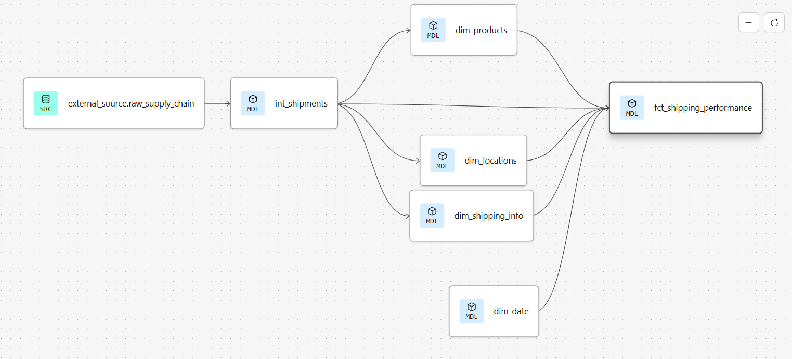

# Nexus: Supply Chain Intelligence Lakehouse: End-to-End Medallion Pipeline (dbt + Databricks + Power BI)

## 📊 Project Overview
This repository contains a high-performance Data Engineering pipeline that refactors raw, nested supply chain shipment data into an optimized **Star Schema**. Designed specifically for Power BI "Drill Down" analytics, the project utilizes the **Medallion Architecture** (Bronze, Silver, Gold) to ensure "Zero-Defect" reporting and full data traceability.


## 🏗️ Infrastructure & Data Engineering

### 1. dbt Medallion Pipeline (Lineage)
The pipeline transitions from a flat transactional stream to a convergent Star Schema, ensuring that the Fact table is fully validated against tested Dimensions.




* **Bronze:** Raw landing zone.
* **Silver:** `int_shipments` Transformation hub using MD5 surrogate keys.
* **Gold:** Consumption layer with `fct_shipping_performance` and modular dimensions.
---

## 🏗️ Infrastructure & Setup

### 1. Databricks Warehouse Configuration
The compute layer is hosted on Databricks to leverage Delta Lake's performance:
* **SQL Warehouse:** A "Pro" SQL Warehouse was provisioned to handle compute for `dbt-fusion` workloads.
* **Server Hostname & HTTP Path:** Configured unique cluster paths (e.g., `/sql/1.0/warehouses/...`) in the dbt `profiles.yml` to route queries directly to the compute instance.
* **Authentication:** Secured via a **Personal Access Token (PAT)** generated in Databricks User Settings for service-account authorization.

### 2. dbt Project Initialization
* **Adapter:** Utilized `dbt-databricks` for native compatibility with Spark/Delta Lake.
* **Layer Strategy:**
    * **Bronze:** Raw Landing (`external_source`) - Preserves original state for reprocessing.
    * **Silver (`int_shipments`):** Transformation hub for data sanitization, type casting (Decimal/Timestamp), and MD5 surrogate key generation using `dbt_utils`.
    * **Gold:** Modular Star Schema consumption layer featuring `dim_` tables and the central `fct_` table.

---

## 🛠️ Technical Challenges & Resolutions

| Challenge | Resolution |
| :--- | :--- |
| **Granularity Mismatch** | Pivoted from Order-level to **Order-Item-level** (`shipment_item_id`) to ensure accurate financial reporting and granular drill-down analysis. |
| **Missing Master Data** | Implemented **Inferred Dimensions**; extracting and deduplicating unique entities (Products/Locations/Shipping Info) directly from the transactional stream. |
| **dbt 2.0 Syntax Migration** | Migrated generic tests to the new `arguments` block syntax to support `dbt-fusion 2.0-preview` requirements and strict YAML parsing. |
| **Date Range Gaps** | Implemented a **Coalesce Safety Net** in the Gold layer. If a shipment date falls outside the `dim_date` range, the pipeline falls back to the transactional date rather than returning a `NULL`, preventing report "leakage." |
| **Referential Integrity** | Centralized **Surrogate Key** generation in the Silver layer to ensure 100% key-matching across the entire pipeline. |
| **SLA False Positives** | Standardized `order_status` logic to ignore 'Cancelled' orders in performance metrics. |
| **Waterfall Alignment** | Used DAX `BLANK()` placeholders to "hide" redundant bars and let the Total column act as the Target. |
| **Lifecycle Sync** | Validated that `COMPLETE` and `CLOSED` statuses yield identical values, confirming 100% reconciliation. |
| **KPI Inflation** | Standardized order status logic to prevent non-realized revenue (Cancellations/Fraud) from skewing targets. |
---

## ✅ Data Quality & "Zero-Defect" Testing
We implemented a multi-layered testing strategy to ensure dashboard numbers remain credible and "Blank" values are eliminated in BI slicers.

### 1. Schema Tests (Generic)
* **Uniqueness & Null Handling:** Applied `unique` and `not_null` tests to `shipment_item_id` and all surrogate keys to prevent row-inflation and duplicate sales reporting.
* **Financial Integrity:** Hardened metrics with `not_null` constraints on `sales_amount` and `profit_amount`.

### 2. Referential Integrity (Relationship Tests)
To support dbt 2.0 standards, all relationship tests use the new `arguments` pattern:

```yaml
# Example: Product Dimension Relationship Test
- name: product_key
  tests:
    - relationships:
        arguments:
          to: ref('dim_products')
          field: product_key
```

### 3. Logic Validation
Hardened measures to exclude non-realized revenue streams.
---

## 💡 Lessons Learned
* **Upstream Key Generation:** Moving surrogate key generation to the Silver layer (`int_shipments`) made the code "DRY" (Don't Repeat Yourself) and eliminated data fan-out during Gold-layer joins.
* **Dimensional Expansion:** Added `Order Status` (Logical state) alongside `Delivery Status` (Physical state) into dim_shipping_info to provide a 360-degree view of the shipping lifecycle.
* **Lineage Convergence:** Restructuring `ref()` logic transformed the lineage from parallel, disconnected tables into a **convergent star schema**, where the Fact table explicitly depends on validated Dimensions.
* **Temporal Analytics:** Created a `dim_date` table and standardized `order_date` keys in the fact table to support Power BI Time Intelligence and prevent "Blank" values in report slicers.
* **Contextual Narratives:** Users prefer "Automated Analysis" over "Static Charts."
* **Correlation Awareness:** Analyzing `Late Rate` alongside `Cancellation Rate` revealed that logistics delays are a primary driver of lost revenue.

---

## 🚀 How to Run
1. **Ensure Infrastructure is Active:** Verify that your Databricks SQL Warehouse is currently **Running**.
2. **Install Required Packages/Dependencies:** Run the following command to install dependencies like `dbt_utils`:
   ```bash
   dbt deps
   ```
3. **Build and Test:** Execute all models and run data quality tests simultaneously to ensure a "Zero-Defect" deployment: 
    ```bash
    dbt build
    ```